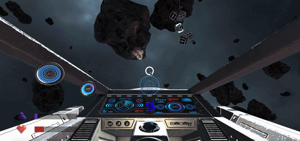

# Proyecto de Realidad Virtual: Space Runaway

Adrián Álvarez León · Jorge González Cabrera · Francisco Cruz Zelante

*Interfaces Inteligentes, 2019-2020*

## Introducción

Space Runaway es un videojuego de realidad virtual de acción, en el que el jugador se convierte en el piloto de una nave espacial cuyo objetivo es llegar a la nave nodriza. Por el camino, sin embargo, se encontrará con varios enemigos que dificultarán su objetivo.

## Aspectos del juego

- El movimiento de la nave se basa en avanzar y retroceder. Mientras que la rotación se puede realizar en torno al eje *x* y *z*, lo que será suficiente para recorrer toda la escena.
- El jugador puede disparar a las naves enemigas para destruirlas, y estas también pueden dispararle a él, aunque hay varios tipos de enemigos y por lo tanto pueden haber distintas formas de atacar al usuario, por ejemplo en el caso de las naves _kamikaze_ también intentarán colisionar con él para matarlo.
- El mundo está lleno de asteroides que, al chocar contra ellos, destruyen automáticamente la nave del jugador. Por otro lado, también hacen el mismo daño a los enemigos, lo que se puede aprovechar a favor del jugador si consigue que estos se estallen contra los asteroides.
- El juego está diseñado para jugar en realidad virtual, y las recomendaciones empleadas para facilitar la integración al jugador han sido seguidas. Recomendamos jugarlo sentado debido a la falta de suelo para orientar al jugador.
- El objetivo del jugador es llegar a la nave nodriza sin que lo maten. Tiene la capacidad de recibir algunos disparos, pero deberá ser cuidadoso porque su vida no se regenera.
- El jugador no puede disparar indefinidamente. Cada bláster se sobrecalienta y en ese caso se debe esperar unos segundos para volver a disparar. 
- El jugador, al igual que las naves enemigas, tiene la capacidad de realizar movimientos bruscos hacia los lados denominados *dashes*. Estos son particularmente útiles para realizar esquives, tanto de asteroides como de los disparos (si tiene buenos reflejos).

### Confort del jugador

#### Movimiento de la cabeza

Nuestra recomendación es que no se mueva la cabeza dentro de lo posible para evitar mareos. Sin embargo, la cabina de la nave permite ver el exterior tanto a la izquierda como a la derecha de esta, pero no hay ninguna obligación de mirar para la ejecución del juego. Para elementos de la interfaz de usuario el movimiento de la cabeza se ha reducido al mínimo posible.

#### Texto

Nosotros consideramos que el texto es legible en todo momento y se sitúa a una distancia adecuada.

#### Seguimiento de partes del cuerpo

No ha sido necesario la implementación de este apartado. El menú se controla con el movimiento de la cabeza y la nave con un gamepad.

#### Comodidad fisiológica

La cámara no se mueve sin la intención del usuario. La nave se moverá con el gamepad y la vista con el movimiento de la cabeza. Además, se ofrece un punto que sirve de referencia a donde se está mirando que también se utilizará para seleccionar las opciones del menú.

#### Comodidad ambiental

En este apartado podríamos tener algunos problemas. En primer lugar, la agorafobia (fobia a los espacios abiertos). El juego es literalmente un espacio sin fin lleno de asteroides, pero es una parte esencial para el juego que queríamos desarrollar así que es inevitable. 

Por otro lado, aunque nos encontremos en la cabina de una nave, no consideramos que se produzca claustrofobia (fobia a espacios pequeños) ya que los cristales dan sensación de no estar encerrados. Además, se ofrece mucha visibilidad.

#### Suelo

Debido a la naturaleza del juego, que trata de naves espaciales, no hay ningún suelo. Parte de la gracia es que podamos movernos indefinidamente en cualquier dirección. A cambio, hemos puesto unos asteroides estáticos para que, de alguna forma sirvan de referencia. Por otro lado, nuestra idea inicial de mantener los asteroides en movimiento constante para aumentar el realismo también aumentaba mucho la complejidad del juego.

#### Métodos de entrada de datos

Para utilizar el juego necesitaremos un gamepad como el que mostraremos más adelante. En general todos los gamepad siguen una estructura muy similar, y siempre se podrá mirar antes de ponernos las gafas. Hemos intentado hacer que los controles se parezcan a los que suelen haber en este tipo de juegos. Por lo tanto, consideramos que es suficiente para optimizar la adaptación de los usuarios. Sin embargo, tiene muchos controles así que probablemente deban practicar antes de sentirse cómodos.

#### Sonido

En el juego el usuario no puede tocar nada por lo que no necesitamos sonidos para simular el contacto. Sin embargo, se han añadido diversos sonidos para aumentar la inmersión en el juego. Actualmente es capaz de reproducir explosiones, disparos, desplazamientos, colisiones de bala y el movimiento *dash*. 

#### Velocidad constante

La velocidad no es completamente constante. Hay un breve momento al empezar a acelerar y al dejar de hacerlo que necesita coger impulso y terminar de perderlo respectivamente. De resto el movimiento es uniforme y, de hecho, esos pequeños momentos no nos han parecido que provoquen malestar. 

#### Inicio controlado

Al iniciar el juego hay un menú para evitar entrar de golpe en el juego. En él se nos darán algunas opciones que veremos en otros apartados.

## Cuestiones importantes de uso

El juego está diseñado para ser jugado con las _google carboard_. Para poder tomar acción en el juego, es necesario tener un mando conectado por bluetooth al dispositivo. Este mando debe ser parecido a los típicos usados por consolas, o al menos que permita al jugador rotar, acelerar, frenar, acceder al menú, disparar y realizar *dashes* laterales.

Al empezar el juego se mostrará una ventana para poder decidir entre jugar o salir. Si decidimos jugar comenzará la ejecución del juego. En cualquier momento podemos acceder al menú y veremos distintas opciones. Podemos continuar con la ejecución, que también puede seleccionarse volviendo a pulsar el botón *Menú*; reiniciar el juego, que reiniciará la escena y nos devolverá a la ventana inicial; la opción salir del juego igual que en el inicio y una opción *Menú* que nos llevará a diferentes opciones. Ahora mismo sólo se puede controlar el volumen de los efectos y de la música pero se ha planteado para que tenga más opciones en el futuro. Para manipular el sonido sólo hay que pulsar las flechas de los laterales y pulsando el botón *Back* volveremos a la ventana anterior. Finalmente, tanto si ganamos como si morimos tendremos una ventana que nos lo notifique y que nos permitirá volver a jugar o salir del juego. Todas estas ventanas pueden verse en el apartado *[Menú de opciones](#Menú-de-opciones)*, donde también explicaremos como ha sido desarrollado.

### Configuración del mando

Mando: Mars Gaming MGP1

  

  

Hemos ofrecido una alternativa a la rotación de la nave debido a que las flechas del mando que estamos usando no funciona correctamente. De esta forma, si en algún momento falla, se puede utilizar el joystick izquierdo. También, gracias a una [app](https://play.google.com/store/apps/details?id=com.Evag.UACL) que nos confirmaba que botones se estaban pulsando, detectamos que dicho joystick es muy sensible y que detecta movimiento cuando no se toca. Por eso en el atributo *dead* en el *Input Manager* hemos puesto como valor *0.7*, para que los valores inferiores a ese sean ignorados.

### Abrir el proyecto en Unity

A veces, al abrir el proyecto en Unity, es posible que algunos assets den problemas. Suele ser el caso de algunos descargados de la Asset Store, que necesitan ser reimportados:

- TextMesh Pro: aparece un error en la consola por repetición de ficheros.
- Oxar Freighter: no se renderiza la nave nodriza *(MotherShip)*.

Por otro lado, algunos elementos de la UI suelen dar problemas para mostrarse al desconfigurarse el tipo. Basta con ir a la carpeta `Assets/Resources` y seleccionar todos los archivos `.png`, y en el Inspector en Unity seleccionar `Sprite 2D` en el desplegable `Texture Type`.

## Hitos de programación

### Utilización de árboles de comportamiento distintos para definir las IAs de las varias naves enemigas distintas

La inteligencia artificial empleada para las naves enemigas ha sido realizada con árboles de comportamiento. Estos árboles, en síntesis, permiten de una manera simple e intuitiva definir el comportamiento de una entidad en base a determinadas acciones y condiciones programables que luego pueden ser combinadas en ramas usando nodos de tipo "selector", "secuencia", etc. La ventaja principal de este sistema es que facilita la construcción de comportamientos complejos a partir de otros más simples. En este documento hablaremos de forma general sobre los comportamientos, para conocer más detalladamente como funcionan los árboles puede acceder [aquí](https://docs.google.com/document/d/1LTw0CHPVsE2F4uNFYRf_9H9fSKghiftniycMtL6lUW0/edit?usp=sharing).

La meta de los enemigos es llegar al usuario (sin chocar con los asteroides) para intentar destruirle. Durante dicha pelea intentarán evitar su destrucción en la medida de lo posible. Funcionan de forma similar al usuario pero tiene ciertas diferencias. En primer lugar, su movimiento ha sido necesario hacerlo con el *transform* para facilitar el trabajo del árbol de comportamiento. Las fuerzas dejan un movimiento residual con el que es dificil trabajar y hace a las naves propensas de chocar con asteroides. Además, rotan en el eje *y* principalmente, aunque no sería ningún problema cambiar el eje de rotación al eje *x*.

#### Enemigo de asalto

El primer tipo de enemigo persigue al jugador desde una distancia prudente. Si se acerca mucho, entonces parará e incluso dará marcha atrás. 

La nave se acercará al jugador siempre que esté demasiado lejos del jugador o mientras no estemos a tiro. Esta última condición es necesaria para provocar que la IA busque al jugador, aun si está muy cerca de él pero hay elementos en medio que le impiden que haya una línea de visión directa. En caso de que no tenga que avanzar y esté demasiado cerca se alejará marcha atrás para evitar chocarse. 

Antes de desplazarse deberá comprobar hacia donde debe dirigirse. Para ello comprobará si puede dirigirse en línea recta o tiene un asteroide cerca entre él y el objetivo, caso en el que determinará cuanto debe rotar para esquivarlo. 

Si ha sido posible dirigirse hacia el objetivo comprobará que le queda poca vida o que no ha superado un umbral de sobrecalentamiento, en cuyo caso nosotros permitimos que dispare. Pero antes de disparar tendrá que comprobar de todas formas que no está esperando para que se enfríen los blásters. Finalmente si el objetivo se encuentra en el rango de ayuda al apuntado y hay una línea directa hacia él se podrá disparar y aumentar el sobrecalentamiento.

Al igual que aumentamos el sobrecalentamiento también lo reducimos en cada iteración siempre que tenga un poco de sobrecalentamiento pero no haya llegado al estado *cool down*.

Paralelamente al resto de acciones comprobará en todo momento si se ha perdido demasiada vida para hacer un *dash* y evitar seguir perdiéndonla. En caso de que deba esquivar comprobará si tiene espacio suficiente a su izquierda para desplazarse, en caso contrario comprobará su lado derecho. Puede que no haga un *dash* si considera que puede morir haciéndolo en cualquiera de las dos direcciones.

Para ver  una imagen representativa del árbol de comportamiento puede acceder al siguiente [enlace](https://i.imgur.com/xm8NTRP.png).

#### Enemigo kamikaze

El otro enemigo persigue al jugador hasta que se choca con él, lo que destruirá ambas naves. Tiene muchas similitudes con el comportamiento de los enemigos de asalto. Simplemente hemos quitado la capacidad de alejarse del enemigo. Ahora se acercará siempre lo máximo que pueda. Por otro lado, ahora tampoco tiene medidas evasivas (*dash*), ya que le alejaría de su objetivo de chocarse con el jugador.

Para ver  una imagen representativa del árbol de comportamiento puede acceder al siguiente [enlace](https://i.imgur.com/OGoRoxk.png).

#### Aspectos al margen del comportamiento

Además del comportamiento, las naves son visualmente diferentes y debido a su naturaleza la nave kamikaze tiene casi el triple de vida. Cada bala quita una unidad de vida y el usuario cuenta con 200 unidades de vida, al igual que los enemigos normales. Mientras tanto, los enemigos kamikaze tienen 500 unidades para facilitarle alcanzar al jugador.

|  |  |
| ------------------------------------ | ------------------------------------ |
| Enemigo kamikaze                     | Enemigo de asalto                    |

Visualmente la nave del jugador es igual a la nave del enemigo de asalto.

### Generación de asteroides

La generación de asteroides se planteó de diversas formas, todas ellas con la gran desventaja de consumir muchos recursos. 

La idea inicial era la creación de una matriz de tamaño fijo y grandes dimensiones que almacenase una serie de _objetos asteroide_ y que los fuera instanciando según el jugador se movía. El problema de este planteamiento, a parte del consumo excesivo de recursos, era la rigídez que suponía a la hora de mover al jugador libremente por el mundo, ya que al ser una matriz de tamaño fijo si se movía fuera de ella no había asteroides. 

Para solventar ambos problemas se hizo uso de una técnica denominada _Object Pooling_. Esta técnica consiste en tener una lista de objetos fijos que en lugar de ser instanciados y destruidos son en su lugar reciclados.

En nuestro caso tenemos una lista de asteroides que instanciamos inicialmente y vamos moviendo a lo largo del mundo a medida que avanza el jugador. Estos forman un cubo alrededor del usuario y se trasponen acomodándose a la trayectoria deseada, de modo que los asteroides más alejados del usuario en dirección opuesta a su movimiento pasan a ser (pasado un umbral) los más alejados en dirección al movimiento del usuario.

  

De este modo el jugador puede moverse por el mundo en cualquier dirección y jamás encontrará una ausencia de asteroides.

### Utilización de sistemas de partículas para las explosiones y los disparos

Tanto los disparos del jugador y los enemigos, como las explosiones de las naves usan sistemas de partículas para darles un efecto ligeramente más realista y espectacular. 

La configuración del sistema de partículas para la explosión ha salido de la *Asset Store*, concretamente del *asset* [FX Fire Free](https://assetstore.unity.com/packages/vfx/particles/fire-explosions/fx-fire-free-21587). Básicamente cuando la vida de una nave llega a cero se muestra esta explosión a la vez que todos los hijos de lo que se compone la nave salen disparados por una fuerza. Para ello, primero hay que desenlazarlos de la nave. Finalmente después de un segundo se destruyen todos los objetos implicados.

En el caso de las balas se utilizó [War FX](https://assetstore.unity.com/packages/vfx/particles/war-fx-5669) para generar sensación de impacto cuando la bala colisionara con algo y tuviera que destruirse. En el caso de no chocar las balas serán destruidas al recorrer una cierta distancia. 

### Interfaz de usuario 

#### HUD

El juego cuenta con un HUD que permite visualizar la vida y el sobrecalentamiento del arma. Estas barras han sido implementadas con _Sliders_ y se regulan mediante el uso de eventos que se disparan desde el script que procesa las colisiones.

Los iconos que se ven al lado de las barras no son más que _Sprites 2D_ para hacer visualmente más atractiva la interfaz.

Por defecto el prefab de la nave trae consigo una retícula, esta no indica la dirección de disparo con exactitud (pues usamos una ayuda al disparo) pero si el disparo fuera recto estaría centrada al punto donde ambas balas coincidirían.

| | | 
| -------- | -------- |

#### Menú de opciones

El juego cuenta con un menú de opciones que le permite _jugar_, _salir_, _reiniciar_ y _ajustar_ los volúmenes de música y efectos.

Inicialmente el menú se implementó con el modo de renderizado: _Screen Space - Camera_ lo cual simplificaba mucho el trabajo, pues automáticamente los elementos del menú se ajustaban al espacio de la pantalla y se quedaban fijados a la cámara.

No obstante, esto es totalmente contrario a los requerimientos de la VR pues el usuario no puede mirar al menú si el menú se mueve con su mirada. Para solventar este problema hubo que cambiar el modo de renderizado a _World Space_. Este cambio implicó que la UI pasó a ser un objeto más del mundo que se ancló a la cabina de la nave y se ajustó para ser visualmente cómodo de usar.

 
    

|  |  |
| ------------------------------------------ | ---------------------------------------- |
|    |   |

#### Integración de Realidad Virtual

Para poder utilizar las _Google Cardboard_ a parte de seguir las indicaciones del aula virtual ha sido necesario implementar dos scripts _ButtonVRController_ y _SliderVRController_.

El primero se encarga de activar los botones cuando la mira de la VR pasa encima de ellos, permitiéndo así que el usuario pulsando un botón del gamepad pueda seleccionar dicha opción.

El segundo tenía como objetivo inicial ser análogo del primero, no obstante, no fue posible que funcionase del mismo modo y paso simplemente a ser un script encargado de modificar el estado del slider y llamar a la lógica detrás de este.

### Integración del sonido

Para la integración del sonido se hace uso de la herramienta _AudioClip_ de Unity.

En un script personalizado _AudioManager_ disponemos de diversos sonidos separados en dos listas, música y efectos del juego. Los sonidos se arrastran directamente al inspector de Unity, donde se puede elegir el *Pitch* y *Volumen* de estos.

 
 
 

### Sistema de ayuda al apuntado

La nave cuenta con un sistema de ayuda al apuntado, de modo que cuando el jugador apunte cerca de una nave enemiga pero sin que la mira coincida de manera exacta, los cañones se redirigirán hacia el enemigo de manera automática. El funcionamiento, en resumen, parte del lanzamiento de un `BoxCast` desde la mira del jugador para detectar si en en el rango de ayuda establecido hay naves enemigas, ignorando el resto de elementos. Si las hay, entonces usa un `RayCast` para comprobar si hay una línea de disparo directa entre ambos. De ser así, entonces con la información provista por el `RayCast` se calcula la rotación necesaria de los cañones para que las balas vayan directamente al enemigo. Además, se tiene en cuenta la velocidad del objetivo para que siga la dirección de la nave. Sin embargo, eso no quiere decir que vaya a acertar el disparo ya que los *dashes* son movimientos muy rápidos, y de hecho ese mismo movimiento puede sacarlo del área de disparo. La necesidad de usar el `RayCast` se debe a que el `BoxCast` podría detectar primero un asteroide, pero eso no quiere decir que no haya un enemigo más lejos que esté visible para el jugador. Por otro lado, si sólo utilizaramos el `RayCast` no estaríamos comprobando el rango de ayuda que le hemos establecido. 

 
    

Como detalle importante, todas las ayudas al apuntar ignoran las balas para evitar confusiones. De hecho ellas mismas se ignoran para destruirse, ya que cuando apuntan a un determinado punto sus *colliders* se detectan antes de al propio objetivo.

### Flecha apuntando al enemigo

Ante la dificultad de encontrar al enemigo en algunas ocasiones se ha implementado una flecha azul que apunta al enemigo con un simple `LookAt`. Esta se puede ver en el interior de la nave. Como dificultad encontramos el constante cambio de enemigo, ya que se eliminan durante la ejecución del juego, por lo que debemos de comprobar en cada iteración si el enemigo ha cambiado.

Por otro lado, también cambia de color a rojo cuando detecta que tiene menos vida que en iteraciones anteriores. Esto último sirve como aviso de que debemos protegernos.

|  ||
|--|--|

### Localización de la nave nodriza

Ya teníamos una flecha para señalar donde estaba situado al enemigo así que buscamos otra forma de señalar la nave nodriza. Utilizamos un `sprite` con una imagen que la represente que rotará alrededor de la cámara en dirección al objetivo. La controlamos para que la imagen siempre esté mirando en dirección a la cámara para poder verla de frente al dirigirnos a ella. Además, hemos decidido que dicha imagen sólo se verá por los cristales de la nave así que se encuentra a una distancia mayor a las dimensiones de la nave. Debido a esto, estar demasiado cerca de un asteroide podría evitar que la visualizaramos. Por otro lado, si un enemigo se acercara en la misma dirección que el `sprite` tampoco se vería hasta que estuviera suficientemente cerca para que se vieran las alas.

 
     

### Spotlight que cambia su estado si el jugador ataca

Queremos aumentar la inmersión del jugador cuanda ataca, recalcar la idea de que se encuentra en una situación de riesgo y que disfrute de un juego de luces automático cuando entra en un tiroteo.

Para ello se ha desarrollado un script (_SpotlightController_) que regula una luz de tipo _Spotlight_ que apunta en todo momento al frente del usuario. Esta luz se tiñe de rojo y disminuye su dispersión (centrándose en el centro de mira de la nave) cuando el usuario dispara.

| |  |
| -------- | -------- |

### Controlador de Eventos

Se ha hecho uso de eventos para manejar diferentes situaciones específicas evitando el uso de la funciones _Update_ y _FixedUpdated_.

Concretamente los eventos que se han creado (agrupados por contexto) son:

*    _OnHealthPctChanged_, _OnOverheatPctChanged_. Eventos a los que se suscriben funciones relacionadas con la pérdida de vida y el sobrecalentamiento (Como las necesarias para actualizar los valores de las barras dispuestas en el HUD).
*    _OnMaximumOverheat_. Evento al que se suscribe la corutina que disminuye el sobrecalentamiento del arma del usuario.
*    _OnAttackModeEnter_, _OnAttackModeExit_. Eventos al que se suscribe el cambio de luces de la nave del usuario cuando comienza y termina de disparar.
*    _OnPlayerDestruction_, _OnEnemyDestruction_. Eventos al que se suscriben las funciones de destrucción de la nave del jugador y del enemigo, respectivamente.
*    _OnPlayerWon_. Evento al que se suscribe la función para desplegar el menú de victoria.

### Sobre el desarrollo del proyecto: problemas con Unity y control de versiones

El control de versiones con Unity es un tema enrevesado. Muchas veces, al hacer _pull_ de los archivos del proyecto, nos sucedía que los scripts se desvinculaban, los assets no mantenían su tipo, los prefabs desaparecían, etc. 

Para solucionar una parte de estos problemas, programamos un script que se encargara de instanciar antes de comenzar el juego distintos elementos y les añadiese sus scripts correspondientes.

No obstante con esto no era suficiente, en ciertas ocasiones se desvinculaban inclusive _partes_ de objetos de la escena, por motivos que en el momento desconocíamos y que acabaron siendo achacados a la pérdida de metadatos durante la subida del proyecto a _GitHub_.

Corrigiendo el _.gitignore_ para subir los metadatos conseguimos solucionar también la pérdida de funcionamiento al reestructurar los ficheros en carpetas.

A pesar de esto en ciertas circunstancias puede haber errores que necesiten ser manejados manualmente por quien abre el proyecto, como reimportar assets o configurar imágenes como _sprites 2D_.

## Capturas de ejecución  

Cuando se pulsa en botón *Menú* veremos las opciones que tenemos disponibles.

 
    

Se puede apreciar fácilmente como se generan todos los asteroides según avanzamos y que el indicador de la nave nodriza efectivamente nos guía hasta nuestro objetivo.

 
     

Nuestro primer tipo de enemigo es el de asalto. En este video se puede ver como funciona nuestro juego: las barras de vida y sobrecalentamiento fluctuan, nuestro indicador del enemigo se mueve con nosotros a la vez que nos indica cuando nos estamos haciendo daño y al enemigo es difícil plantarle cara.

 
     

El *kamikaze* no se frenará nunca hasta llegar a nosotros. Cualquier duda en nuestros movimientos hará que nos alcance.

 
     

Durante las batallas podremos ver como nuestros blásters apuntan al objetivo aunque no estén exactamente en el centro de nuestra mira. Además, se aprecia como todo se vuelve rojo, lo que llamamos _Spotlight_.

 
    

Como habíamos dicho, al eliminar un enemigo se separan todas sus piezas y se muestra una explosión.

 
    

## Acta de trabajo

### Reparto de tareas

- Adrián Álvarez León
    - Generación de Asteroides.
    - Nodos de esquiva de asteroides.
    - Regeneración de enemigos.
    - Creación e implementación de la lógica del HUD y los menús.
    - Integración de la VR para el uso de menús.
    - Implementación de Delegados (eventos).
    - Integración del sonido (música y efectos).
    - Animación de luces en el modo ataque.

- Jorge González Cabrera
    - Destrucción de las naves.
    - Disparos con autoapuntado.
    - Comportamiento y visualización de las balas.
    - Nodos de movimiento y disparo en el árbol de comportamiento.
    - Configuración del enemigo estilo kamikaze.
    - Localización de la madre nodriza (con un icono).

- Francisco Cruz Zelante
    - Movimiento de las naves.
    - Movimiento del dash.
    - Nodos de disparo en el árbol de comportamiento.
    - Programación del sobrecalentamiento de la nave enemiga.
    - Refactorización del código.

- Común
    - Configuración del Gamepad.
    - Códificación de los árboles de comportamiento.
    - Flecha de apuntado al enemigo.
    - Solución de bugs y testeo del juego.
